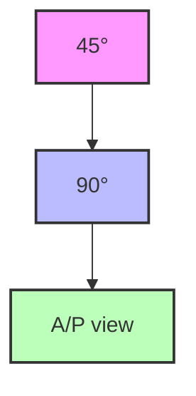

# Page 12 (Enhanced)

*Enhanced on 2025-07-03 12:26:09*
*Document ID: Hip_TRTIIH_SP_2_20250703_121853*
*Enhancements applied: 1*

**Enhancement Notes:**
- General formatting and structure improvements

---

# Trident II Clusterhole HA Surgical Protocol

## Figure 10. Angles and Views in Trident II Surgical Protocol

## Figure 11. Lateral View Angle in Trident II Surgical Protocol

### Notes on Trident II Surgical Protocol

- Avoid catching soft tissue debris onto the frictional shell surface during implantation.

- Shell positioning must be carefully considered when selecting certain inserts as hooded options are not available in all sizes to adjust joint stability. Proper positioning of the Trident II Acetabular Shell may minimize potential impingement and promote stability and articulation between the insert and head. As with any acetabular system, excessive vertical orientation and/or anteversion of the shell should be avoided, as this may lead to premature wear and/or noise of the components' surfaces.

- While the alignment guides offer some assistance in shell placement, it is important to critically evaluate anatomic landmarks before shell implantation. These anatomic landmarks include the anterior and posterior walls of the acetabulum, the sciatic notch, the transacetabular ligament (TAL), the floor and/or acetabular fossa of the acetabulum.

### Caution Regarding Trident II Surgical Protocol

The Alignment Guide's utility may be diminished if the pelvis has moved from the original position during intraoperative manipulation. Small changes in pelvic flexion will greatly affect anteversion. The Alignment Guide is only one aid to assist with proper implant positioning. The surgeon must also rely on anatomic landmarks to avoid improper positioning of components.
